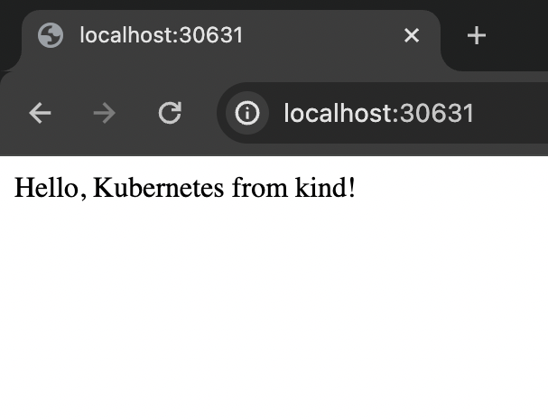

# Deploy a docker container on Kind Cluster



We will create 2 workers, 1 master node cluster and deploy a container running a flask application.

**Steps:**
- [Build Docker Image](#1-build-the-docker-image)
- [Check Image](#2-check-the-docker-image)
- [Create a k8s cluster using kind](#3-create-kind-cluster)
- [Load Image to the cluster](#4-load-the-docker-image-into-kind-cluster)
- [Apply Deployment](#5-apply-deployment-to-kind-cluster)
- [Add a service](#6-expose-the-deployment-with-a-service)
- [Access the app](#7-access-the-app)

Finally,
- [Clean Up](#clean-up)

## 1. Build the docker image 

```bash
 docker build -t myapp:latest .
```

## 2. Check the docker image

Check the image by running it standalone in local machine.

```bash
 docker run -p 8080:8080 myapp
```

## 3. Create kind cluster

Go to the [kind](kind/) directory, open terminal and run -

```bash
 kind create cluster --config kind-config.yaml --name my-cluster
```

get nodes details -

```
 kubectl get nodes
 kind get clusters
```

## 4. Load the docker image into kind cluster

```bash
 kind load docker-image myapp:latest --name my-cluster
```


## 5. Apply deployment to kind cluster

```bash
 kubectl apply -f deployment.yaml
```
returns: deployment.apps/my-app created

## 6. Expose the deployment with a service

```bash
 kubectl apply -f service.yaml

```

# 7. Access the app 

Create a tunnel (port froward) to access the project (local dev only)

```bash 
 kubectl port-forward service/myapp-service 30631:8080
```

> ## Access the app (if service type is LoadBalancer)
>  `kubectl get services`
> or 
> `kubectl get services myapp-service`
> Find the external IP address of the service and open it in your web browser.


# Debug

1. check deployment status. verify is pods have a running status
```bash
 kubectl get pods
```

output: 

```
NAME                     READY   STATUS             RESTARTS   AGE
my-app-65db9958b-ffm6f   0/1     ImagePullBackOff   0          17m
my-app-65db9958b-qqnzn   0/1     ImagePullBackOff   0          17m
```

or,
```
ashrafminhaj@ashrafs-MacBook-Air ~ % kubectl get pods
NAME                     READY   STATUS    RESTARTS   AGE
myapp-77dbdc894d-5fjjq   1/1     Running   0          9s
myapp-77dbdc894d-cqmrz   1/1     Running   0          9s
```

2. delete pods

```
 kubectl delete pods -l app=myapp

```

3. you can get a list of images present on a cluster node by using

```
 docker exec -it <node-name> crictl images

```

4. details 

```bash 
 kubectl describe services myapp-service
 kubectl get pods --output=wide
```

5. expose deployment

```bash
 kubectl expose deployment myapp --type=NodePort --name=myapp-service
```

# Clean Up

```bash
 kubectl delete services myapp-service
 kubectl delete deployment myapp
```

delete cluster 
```
 kind delete cluster
 kind delete clusters --all
```